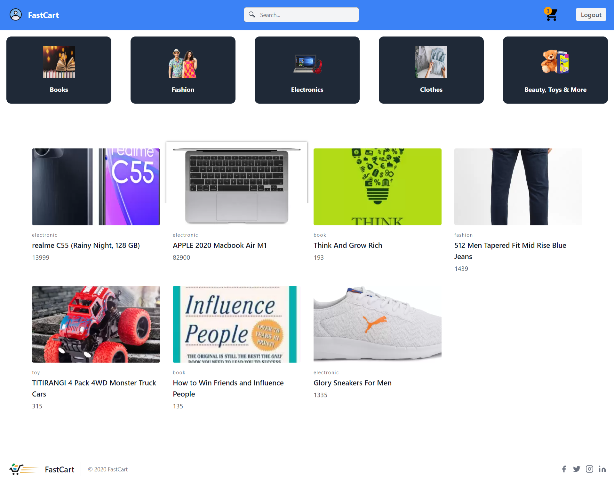

# Ecommerce in MERN stack

This is a fully functional and responsive Ecommerce site



## Features for site Owner
* Admin panal
* Add, remove products and modefy products information
* Track Order 
* Fully Responsive for all devices 

## Features for Users or Customers
* Create account, Login, Logout
* Cart
* Search Bar
* Product page 
* Products separated by categorys

## Installation

```bash
git https://github.com/reo127/mernEcommerceApp

cd mernEcommerceApp

# Goto client, install packges and start server
cd client
npm install
npm start

# Goto client, install packges and start server
cd ..
cd server
npm install
npm start
```


## Contributing
Pull requests are welcome. For major changes, please open an issue first to discuss what you would like to change.


## License
[MIT](https://choosealicense.com/licenses/mit/)